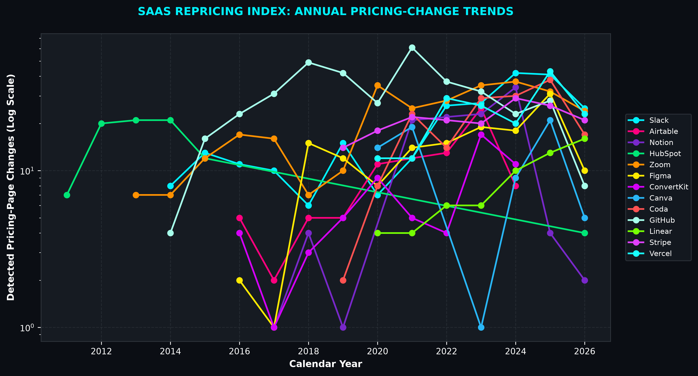
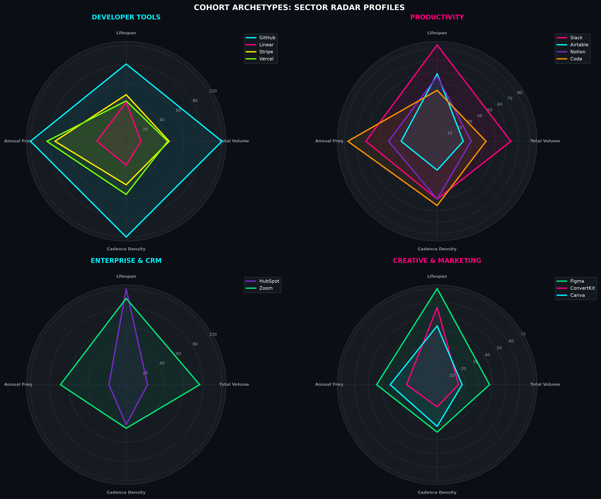
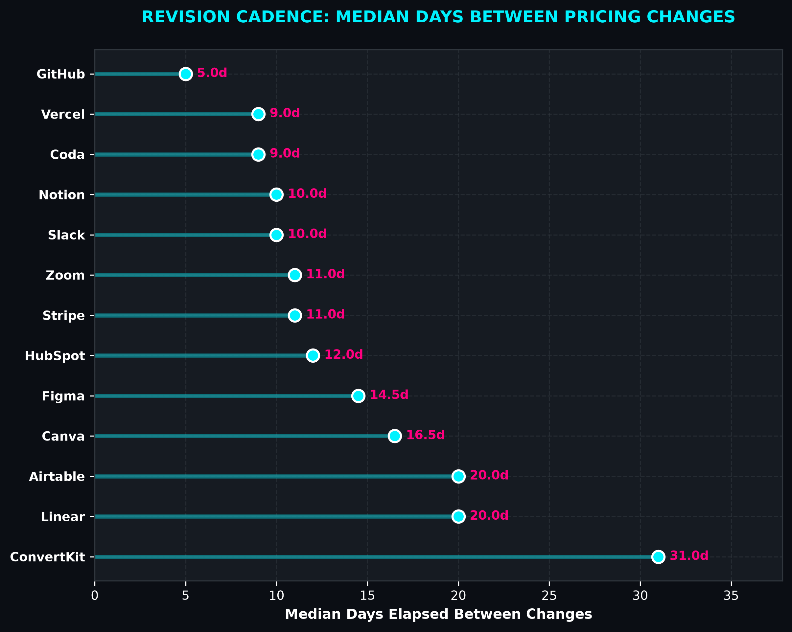

# SaaS Repricing Index

A longitudinal analysis of how frequently 13 SaaS companies revise their observable pricing and packaging strategies through historical Wayback Machine data.

## Project Overview

This project answers a specific business question: **How often do SaaS companies change their pricing pages — and what does that frequency actually tell us about their approach to monetization?**

Rather than relying on manual observation or outdated case studies, I built an automated pipeline to:

- Harvest 15+ years of archived pricing pages from the Internet Archive's Wayback Machine
- Detect meaningful changes by comparing page content (not just price numbers)
- Aggregate change frequency into per-company metrics
- Visualize patterns across 13 companies in four different sectors

The result is a dataset spanning **10,000+ archived snapshots** with real, time-series data showing how each company's pricing surface evolved.

## Why this matters

Most pricing analysis happens retrospectively — "We noticed Company X changed their pricing plan structure in Q3."

This project inverts that: it lets you detect pricing changes systematically and benchmark how frequently different companies experiment with their monetization.

For a Product, Strategy, or Sales team, that's valuable. For someone building pricing infrastructure or competitive-intelligence tools, it's actionable.

See [INSIGHTS.md](./INSIGHTS.md) for the full analysis of what the data revealed.

## The companies

These 13 companies span four sectors:

- **Developer Tools:** GitHub, Linear, Vercel, Stripe
- **Productivity:** Airtable, Coda, Notion, Slack
- **Enterprise & CRM:** HubSpot, Zoom
- **Creative & Marketing:** Canva, ConvertKit, Figma

Selection criteria: Large, public SaaS companies with well-documented Wayback Machine archives (15+ years of snapshots).

## The data pipeline

The project runs four phases:

### Phase 1: CDX Harvesting
Query the Internet Archive's CDX API for each company's pricing page. The API returns metadata about every snapshot: timestamp, HTTP status, content digest.

Output: `data/raw_cdx/*.json` (one file per company, containing metadata for 300–3,500 snapshots each)

### Phase 1b: HTML Download
For each snapshot metadata entry (status 200), download the actual HTML from the Wayback Machine.

Deduplication: If consecutive snapshots have identical content digests, skip the redundant download.

Output: `data/raw_html/<company>/*.html` (deduplicated snapshots per company)

### Phase 2: Parsing & Deduplication
Read the downloaded HTML files. For each company:

1. Extract and clean visible text (strip scripts, styles, boilerplate)
2. Hash the cleaned text with SHA-256
3. Keep only the first snapshot for each unique content hash
4. Record the date and snapshot URL for each unique change

This produces: `data/processed/clean_pricing_events.json` (structured change events)

Also computes: `data/processed/repricing_metrics.csv` (per-company summary metrics)

### Phase 3: Analysis & Visualization
Aggregate metrics across all companies. Calculate:

- Total snapshots per company
- Archived lifespan (first snapshot to most recent)
- Annual repricing frequency (changes per year)
- Median days between detected changes

Generate three visualizations:

1. **Time-Series Chart:** Pricing-page changes per company, per year
2. **Cohort Radar Chart:** Normalize and compare 4 metrics across sector groupings
3. **Cadence Lollipop Chart:** Median days between changes, ranked

Output: Charts saved to `outputs/figures/`, metrics to `outputs/reports/`

## How to run it

### Requirements

- Python 3.11+
- Dependencies: `pandas`, `requests`, `beautifulsoup4`, `matplotlib`, `tqdm`, `urllib3`

### Installation

```bash
git clone https://github.com/Dgs-analytics/startup-saas-repricing-index.git
cd startup-saas-repricing-index
pip install -r requirements.txt
```

### Run the full pipeline

```bash
python main.py
```

This will:
1. Check that your environment is set up correctly (seed CSV exists, directories are ready)
2. Query CDX for all 13 companies (skips companies already harvested)
3. Download HTML snapshots from the Wayback Machine (rate-limited, respectful)
4. Parse all HTML into change-event records
5. Compute per-company repricing metrics
6. Generate the executive summary
7. Render the three charts

**Time:** First run takes 3–6 hours (due to Wayback Machine download time). Subsequent runs are much faster (cached CDX data, deduplication skips already-downloaded files).

### Run individual phases

If you only want to re-run certain phases:

```bash
# Phase 1: CDX harvest (checks for local cache, skips if already done)
python -c "from src.fetch_snapshots import process_seed_manifest, export_summary_manifest; targets = process_seed_manifest(); export_summary_manifest(targets)"

# Phase 1b: HTML download (also checks cache)
python -c "from src.download_snapshots import download_all_html; download_all_html()"

# Phase 2: Parsing and metrics computation
python -c "from src.parse_snapshots import calculate_repricing_metrics; calculate_repricing_metrics()"

# Phase 3: Analysis and visualization
python -c "from src.analyze_metrics import generate_executive_insights; generate_executive_insights()"
python -c "from src.visualize import generate_index_visuals; generate_index_visuals()"
```

### Audit a company's CDX availability

Before committing to a full run, check how much historical data exists for a given company:

```bash
python src/audit.py
```

This queries CDX for each company and reports how many status-200 snapshots are available. Helps you see upfront whether data is abundant or sparse.

## Output structure
outputs/
├── figures/
│ ├── chart1_time_series_index.png (Annual change trends)
│ ├── chart2_strategic_matrix.png (Sector radar profiles)
│ └── chart3_interval_distribution.png (Cadence rankings)
└── reports/
├── executive_summary.csv (Portfolio-level metrics)
└── clean_pricing_events.json (Detailed change records)

data/processed/
├── repricing_metrics.csv (Per-company summary)
└── annual_repricing_trends.csv (Year-by-year change counts)


The `data/raw_cdx/`, `data/raw_html/`, and `data/raw_snapshots/` directories are gitignored — they're large and fully reproducible by running the pipeline.

## Key findings

- **GitHub changes its pricing surface most frequently** (5-day median)
- **ConvertKit is the most stable** (31-day median)
- **Repricing frequency varies dramatically** — there's no single "SaaS repricing pattern"
- **This metric captures more than price changes** — it includes packaging, features, limits, and positioning updates

See [INSIGHTS.md](./INSIGHTS.md) for the full business analysis and what these patterns actually mean.

## Visualizations

The pipeline generates three publication-ready charts analyzing repricing patterns:







## Limitations

1. **Detection methodology:** This project detects visible-text changes on pricing pages. It doesn't distinguish between major pricing shifts and minor copy edits. That's intentional — the raw frequency is useful, but requires human interpretation.

2. **Historical availability:** The Wayback Machine archived some sites more frequently than others. GitHub has dense snapshots; some competitors have gaps. The data reflects what's archived, not what actually changed.

3. **Website structure changes:** When a company redesigns their site, parsing logic might break or capture fewer changes. This is a known limitation and is noted where it occurs.

4. **Causality:** This data shows correlation, not causation. Frequent repricing doesn't prove the strategy works — it just shows the behavior exists.

## Architecture notes

- **Single source of truth for paths:** All file paths are centralized in `src/config.py`, so the pipeline is portable across different machines
- **Idempotent phases:** Phases check for cached data before re-fetching. Safe to re-run without redundant API calls
- **Rate-limiting:** Respectful delays between Wayback Machine requests (0.5s–1.5s between downloads)
- **Content deduplication:** Uses SHA-256 hashing to avoid counting identical snapshots as separate changes
- **Logging:** Comprehensive logging throughout so you can track what the pipeline is doing

## GitHub usage

This is a portfolio project. If you fork it, you can:

1. Add more companies to `data/seed_domains.csv`
2. Adjust the chart styling in `src/visualize.py`
3. Modify the parsing logic in `src/parse_snapshots.py` to detect different types of changes
4. Create your own analysis using `data/processed/repricing_metrics.csv` and `clean_pricing_events.json`

## Questions? Issues?

This was built as a portfolio project to demonstrate:

- End-to-end data pipeline design
- Working with historical/archived data sources
- Translating raw metrics into business insights
- Building defensible analysis (not just dashboards)

If you have questions about the methodology or the findings, see [INSIGHTS.md](./INSIGHTS.md) for the full analyst perspective.

---

**Author:** Daphn (Dgs-analytics)  
**Last updated:** August 2026  
**Dataset:** 13 SaaS companies, 10,000+ snapshots, 15+ years of historical pricing pages