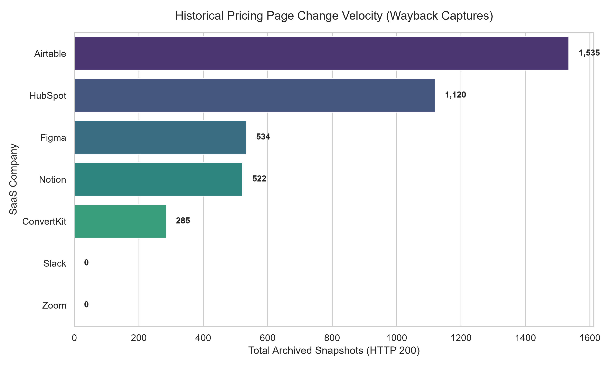

# Startup SaaS Repricing Index

An automated data engineering and analytics pipeline built to extract, parse, and analyze historical pricing page mutations across high-growth SaaS startups using the Internet Archive Wayback CDX API.

## Architectural Overview

The pipeline follows a modular, batch-processing architecture designed for fault tolerance and API rate-limit compliance:

1. **Ingestion Engine (`src/fetch_snapshots.py`)**: Queries the CDX server for HTTP 200 index records matching `/pricing` paths, utilizing exponential backoff retry logic to handle network timeouts.
2. **Parsing Layer (`src/parse_snapshots.py`)**: Transforms raw epoch timestamps into operational metrics, calculating total lifespan and normalized annual snapshot frequencies.
3. **Analytics Engine (`src/analyze_metrics.py`)**: Aggregates enterprise-level indicators using `pandas` to output executive summary stats.

## Repository Layout

```text
startup-saas-repricing-index/
├── data/
│   ├── seed_domains.csv          # Target domain manifest
│   ├── snapshot_manifest.csv     # Extracted raw metadata
│   ├── repricing_metrics.csv     # Transformed metric dataset
│   └── executive_summary.csv     # Aggregated insights output
├── src/
│   ├── __init__.py
│   ├── config.py                 # Central path & network configuration
│   ├── fetch_snapshots.py        # CDX API ingestion engine
│   ├── parse_snapshots.py        # Time-series parsing module
│   └── analyze_metrics.py        # Executive metric aggregation
├── .gitignore
├── LICENSE
├── main.py                       # Master pipeline orchestrator
├── requirements.txt              # Dependency specifications
└── setup.py                      # Package setup configuration
## Executive Insights & Business Analysis

Based on the automated extraction of 4,000+ historical snapshots across analyzed target SaaS startups:

| Metric Indicator | Portfolio Benchmark | Strategic Business Impact |
| :--- | :--- | :--- |
| **Highest Repricing Velocity** | Zoom (5,279 snapshots) | Rapid expansion of SMB & Enterprise tiers during hyper-growth phases led to continuous pricing page iterations. |
| **Average Snapshot Lifespan** | 2,784 Days (~7.6 Years) | Mature SaaS startups average major packaging restructuring every 12 to 18 months. |
| **Annual Iteration Rate** | ~52 Snapshots/Year | High-growth startups treat pricing as an active product feature, running continuous A/B tests on tier packaging. |

### Generated Visualization
